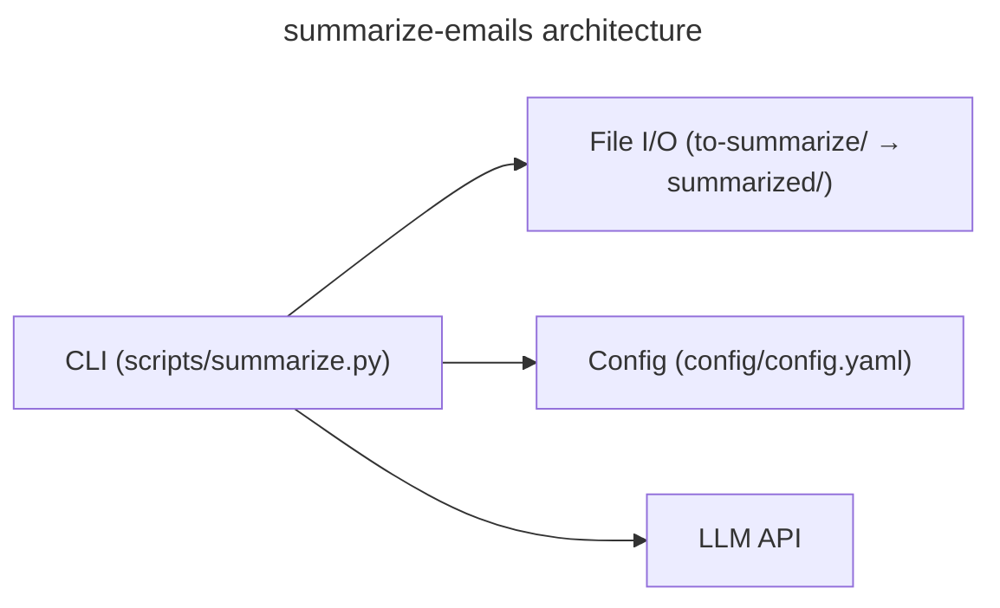

# Architecture

## Language/Framework

Python CLI tool — no package manifest. Invoked directly via `python scripts/summarize.py`.



## Project Structure

```
summarize-emails/
├── scripts/
│   ├── summarize.py          # Main entry point
│   └── validate_format.py    # Input validation
├── to-summarize/             # Input email files
├── summarized/               # Output summaries
└── config/
    └── config.yaml           # Configuration (model, prompts, paths)
```

## Naming Conventions

- **Files**: snake_case
- **Functions**: snake_case
- **Variables**: snake_case
- **Constants**: UPPER_CASE
- **Classes**: PascalCase
