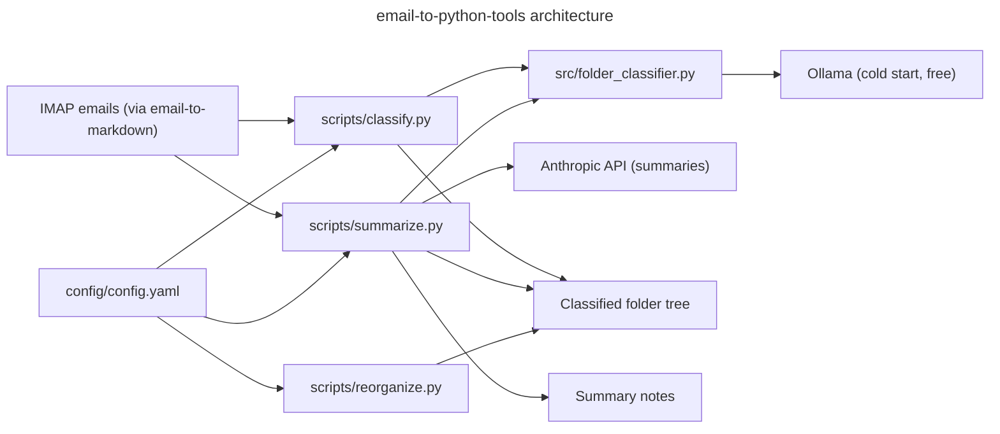

# Architecture

## Language/Framework

Python CLI tool — no package manifest. Scripts invoked directly via `python scripts/<script>.py`.

## Scripts

| Script | Role |
|---|---|
| `scripts/summarize.py` | Pipeline complet : parse → déduplique → catégorise → groupe → résume → classe |
| `scripts/classify.py` | Classement interactif des emails bruts dans l'arborescence |
| `scripts/reorganize.py` | Restructuration interactive de l'arborescence (renommer/fusionner/déplacer) |
| `scripts/validate_format.py` | Validation du format des fichiers .md d'entrée |

## src/ Modules

| Module | Role |
|---|---|
| `src/parser.py` | Parse les .md emails (frontmatter YAML → dict) |
| `src/categorizer.py` | Catégorise : travail / notification / newsletter / associatif |
| `src/deduplicator.py` | Déduplique par (subject_hash, sender) |
| `src/grouper.py` | Groupe par catégorie + clé (sujet normalisé ou expéditeur) |
| `src/age.py` | Calcule l'âge d'un email en jours |
| `src/archiver.py` | Déplace ou supprime les fichiers sources |
| `src/llm.py` | Wrapper Anthropic API (classify_email) |
| `src/folder_classifier.py` | Classifieur de dossiers : Ollama cold start + BernoulliNB incrémental |
| `src/config.py` | `load_config()` partagé entre tous les scripts |
| `src/summarizers/` | Résumeurs par catégorie (travail, notification, newsletter, associatif) |

## Naming Conventions

- **Files**: snake_case
- **Functions**: snake_case
- **Variables**: snake_case
- **Constants**: UPPER_CASE
- **Classes**: PascalCase
