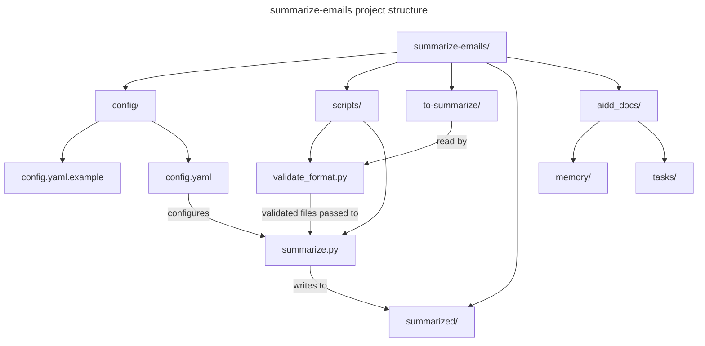

# Codebase Structure

```mermaid
---
title: summarize-emails project structure
---
flowchart TD
  Root["summarize-emails/"]
  Config["config/"]
  ConfigExample["config.yaml.example"]
  ConfigFile["config.yaml"]
  Scripts["scripts/"]
  ValidateScript["validate_format.py"]
  SummarizeScript["summarize.py"]
  InputDir["to-summarize/"]
  OutputDir["summarized/"]
  AiddDocs["aidd_docs/"]
  Memory["memory/"]
  Tasks["tasks/"]

  Root --> Config
  Root --> Scripts
  Root --> InputDir
  Root --> OutputDir
  Root --> AiddDocs
  Config --> ConfigExample
  Config --> ConfigFile
  Scripts --> ValidateScript
  Scripts --> SummarizeScript
  AiddDocs --> Memory
  AiddDocs --> Tasks
  InputDir -->|"read by"| ValidateScript
  ValidateScript -->|"validated files passed to"| SummarizeScript
  ConfigFile -->|"configures"| SummarizeScript
  SummarizeScript -->|"writes to"| OutputDir
```
