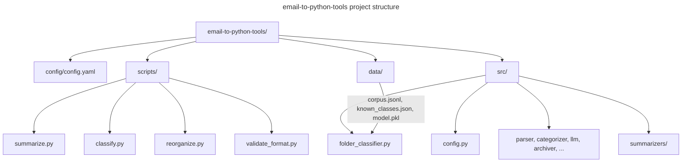

# Codebase Structure



## Key Files

| Path | Purpose |
|---|---|
| `config/config.yaml` | Config centrale : LLM, seuils, chemins, section classify |
| `src/folder_classifier.py` | Module partagé : Ollama cold start + BernoulliNB incrémental |
| `src/config.py` | `load_config()` centralisé, importé par tous les scripts |
| `data/corpus.jsonl` | Exemples étiquetés (runtime, gitignored) |
| `data/known_classes.json` | Registre des classes BernoulliNB (runtime, gitignored) |
| `data/model.pkl` | Modèle sérialisé (runtime, gitignored) |
| `data/vectorizer.pkl` | TF-IDF vectorizer sérialisé (runtime, gitignored) |

## Input Sources

Les emails sont produits par `email-to-markdown` (Rust) et organisés par :
```
<emails_root>/<compte_imap>/<dossier_imap>/<email>.md
```

`classify.input_dirs` liste les répertoires de comptes IMAP à traiter (1 niveau de profondeur).
