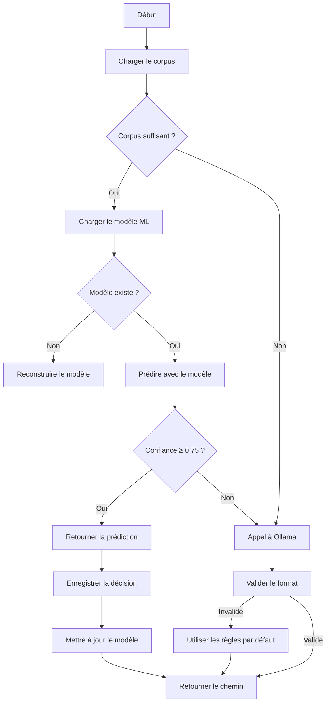

# Processus de Reconstruction et Mise à Jour du Modèle ML

## Overview
Ce document décrit le processus d'apprentissage incrémental du modèle ML utilisé pour classer les emails dans `email-to-python-tools`.

## Workflow Global



## Détails des Étapes

### 1. Chargement du Corpus
- **Fichier** : `data/corpus.jsonl`
- **Format** : Une ligne par email, au format JSON.
- **Exemple** :
  ```json
  {"subject": "Réunion", "sender": "equipe@domaine.com", "email_type": "direct", "label": "Travail/Projets/ClientX"}
  ```

### 2. Reconstruction du Modèle (`rebuild_model_from_corpus`)
- **Déclencheurs** :
  - Premier lancement (modèle inexistant).
  - Corpus vide ou corrompu.
- **Processus** :
  1. Charger le corpus depuis `data/corpus.jsonl`.
  2. Extraire les features (sujet + expéditeur + type d'email).
  3. Vectoriser avec `TfidfVectorizer`.
  4. Entraîner un modèle `BernoulliNB`.
  5. Sauvegarder le modèle et le vectoriseur.
- **Logs** :
  - `INFO` : "Reconstruction du modèle depuis N exemples..."
  - `INFO` : "Modèle reconstruit et sauvegardé avec succès."
  - `WARNING` : "Corpus vide, impossible de reconstruire le modèle."

### 3. Mise à Jour Incrémentale (`record_decision`)
- **Déclencheurs** :
  - Validation utilisateur d'un chemin.
- **Processus** :
  1. Ajouter l'email au corpus (`data/corpus.jsonl`).
  2. Mettre à jour la liste des classes connues (`data/known_classes.json`).
  3. Charger le modèle et le vectoriseur.
  4. Mettre à jour le modèle avec `partial_fit`.
  5. Sauvegarder le modèle et le vectoriseur.
- **Logs** :
  - `INFO` : "Modèle mis à jour avec la décision utilisateur : chemin"
  - `INFO` : "Modèle non trouvé, reconstruction depuis le corpus..."

### 4. Prédiction et Fallback (`propose_path`)
- **Seuils** :
  - `min_samples_before_ml` : 20 (défaut).
  - `confidence_threshold` : 0.75 (défaut).
- **Logique** :
  - Si corpus < 20 exemples → Utiliser Ollama.
  - Si modèle inexistant → Utiliser Ollama.
  - Si confiance < 0.75 → Utiliser Ollama.
  - Sinon → Utiliser le modèle ML.

### 5. Validation des Chemins
- **Format** : `Niveau1/Niveau2/Niveau3` (ex: `Travail/Projets/ClientX`).
- **Règles** :
  - Exactement 2 `/`.
  - Pas de caractères interdits : `?`, `*`, `"`, `<`, `>`, `|`.
  - Longueur max par niveau : 50 caractères.
- **Fallback** : Si invalide, utiliser les règles par défaut (`_EMAIL_TYPE_PATHS`).

## Configuration

### Paramètres dans `config/config.yaml`
```yaml
classify:
  cold_start_model: "qwen3:8b"      # Modèle Ollama pour le fallback
  confidence_threshold: 0.75        # Seuil de confiance pour le ML
  min_samples_before_ml: 20         # Nombre minimal d'exemples pour le ML
  data_dir: "data"                   # Dossier de stockage des données
```

### Fichiers Générés
- `data/corpus.jsonl` : Corpus d'entraînement.
- `data/known_classes.json` : Liste des classes connues.
- `data/model.pkl` : Modèle ML sauvegardé.
- `data/vectorizer.pkl` : Vectoriseur sauvegardé.

## Bonnes Pratiques

### 1. Surveillance des Logs
- Activer les logs en mode `INFO` pour suivre les mises à jour :
  ```python
  logging.basicConfig(level=logging.INFO)
  ```
- Exemple de logs attendus :
  ```
  INFO: Modèle mis à jour avec la décision utilisateur : Travail/Projets/ClientX
  INFO: Reconstruction du modèle depuis 25 exemples...
  INFO: Modèle reconstruit et sauvegardé avec succès.
  ```

### 2. Sauvegarde et Reprise
- Les modèles sont sauvegardés automatiquement après chaque mise à jour.
- Pour reconstruire manuellement :
  ```python
  from src.folder_classifier import rebuild_model_from_corpus
  rebuild_model_from_corpus(Path("data"))
  ```

### 3. Éviter le Surapprentissage
- Utiliser un corpus diversifié.
- Surveiller la confiance des prédictions.
- Ajuster `confidence_threshold` si nécessaire.

## Améliorations Futures

### Validation Croisée
Pour éviter le surapprentissage, une validation croisée peut être ajoutée lors de la reconstruction du modèle. Exemple :
```python
from sklearn.model_selection import cross_val_score
scores = cross_val_score(model, X, labels, cv=5)
logger.info("Scores de validation croisée : %s", scores)
```

### Optimisation des Features
- Ajouter une sélection de features pour réduire la dimensionnalité.
- Utiliser `SelectKBest` ou `PCA` pour améliorer les performances.

## Dépannage

### Problèmes Courants
1. **Modèle non trouvé** :
   - Vérifier que `data/model.pkl` et `data/vectorizer.pkl` existent.
   - Lancer `rebuild_model_from_corpus` si nécessaire.

2. **Corpus vide** :
   - Vérifier que `data/corpus.jsonl` contient des données.
   - Ajouter des exemples manuellement si nécessaire.

3. **Fallback fréquent vers Ollama** :
   - Vérifier `confidence_threshold` dans la configuration.
   - Augmenter la taille du corpus.

## Exemples d'Utilisation

### Reconstruire le Modèle
```python
from pathlib import Path
from src.folder_classifier import rebuild_model_from_corpus

rebuild_model_from_corpus(Path("data"))
```

### Tester une Prédiction
```python
from src.folder_classifier import propose_path

email = {
    "subject": "Réunion projet",
    "sender": "equipe@domaine.com",
    "email_type": "direct"
}
config = {"classify": {"data_dir": "data"}}
path = propose_path(email, config)
print(path)  # Exemple : "Travail/Projets/ClientX"
```

## Notes Techniques

### Algorithmes
- **Vectorisation** : `TfidfVectorizer` (scikit-learn).
- **Modèle** : `BernoulliNB` (Naive Bayes binaire).
- **Mise à jour** : `partial_fit` pour l'apprentissage incrémental.

### Performances
- **Cold start** : Latence dépendante d'Ollama (local).
- **ML** : Prédiction en temps réel (< 100ms).
- **Mémoire** : Modèle léger (~1 Mo).

### Sécurité
- Les chemins sont validés pour éviter les injections.
- Les caractères interdits sont rejetés.
