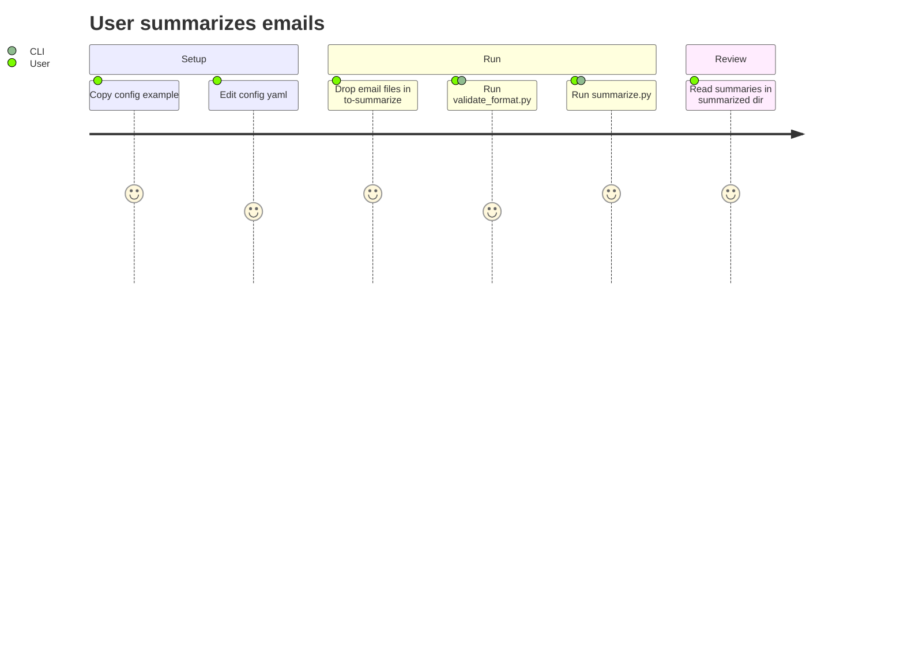

# Project Brief

## Executive Summary
- **Project Name**: summarize-emails
- **Vision**: CLI tool that summarizes email files using AI/LLM
- **Mission**: Automate email summarization from local files to reduce reading time

### Full Description
- Python backend CLI that reads email files from a local directory and produces AI-generated summaries
- Configured via a YAML file; validated inputs before processing

## Context

### Core Domain
- Local email file processing (no live mailbox connection)
- LLM-based text summarization
- Directory-based input/output pipeline

### Ubiquitous Language
| Term | Definition | Synonymes |
|------|------------|-----------|
| Email file | Raw email stored as a file in `to-summarize/` | input |
| Summary | LLM-generated condensed version of an email | output |
| Config | `config/config.yaml` controlling LLM and behavior settings | configuration |
| Validation | Format check run before summarization via `validate_format.py` | — |

## Features & Use-cases
- Validate email files before processing
- Summarize one or all email files via CLI
- Write summaries to `summarized/` directory
- Configurable LLM provider and parameters via YAML

## User Journey

