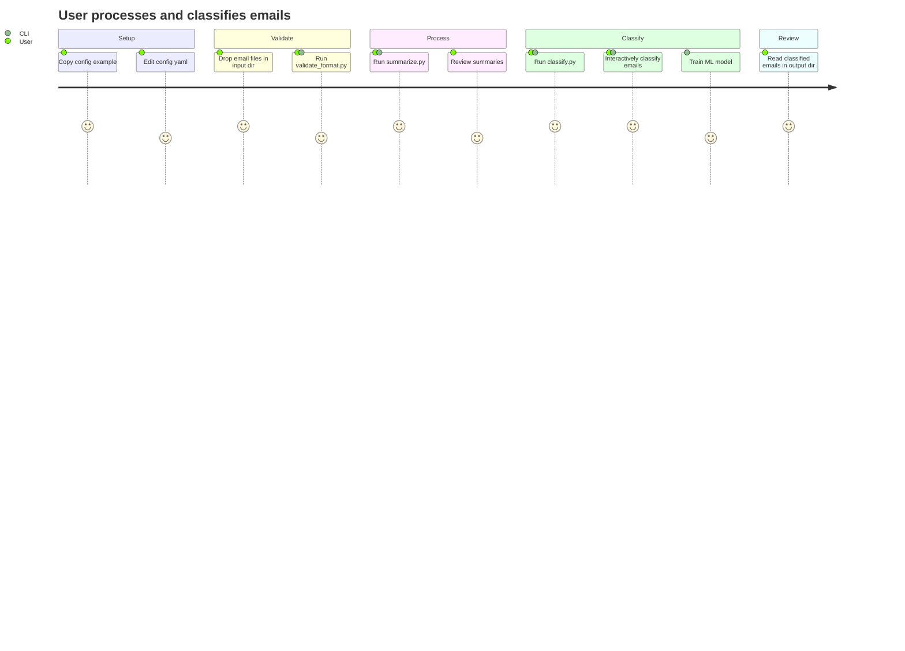

# Project Brief

## Executive Summary
- **Project Name**: email-to-python-tools
- **Vision**: CLI tools to process and classify emails using AI/LLM
- **Mission**: Automate email processing, summarization, and classification from local files

### Full Description
- Python backend CLI that reads email files from a local directory and produces AI-generated summaries and classifications
- Configured via a YAML file; validated inputs before processing
- Includes interactive classification with incremental machine learning

## Context

### Core Domain
- Local email file processing (no live mailbox connection)
- LLM-based text summarization and classification
- Directory-based input/output pipeline
- Interactive classification with user feedback

### Ubiquitous Language
| Term | Definition | Synonymes |
|------|------------|-----------|
| Email file | Raw email stored as a file in input directories | input |
| Summary | LLM-generated condensed version of an email | output |
| Classification | Interactive or automatic assignment of emails to folders | categorization |
| Config | `config/config.yaml` controlling LLM, paths, and behavior settings | configuration |
| Validation | Format check run before processing via `validate_format.py` | — |
| Corpus | Dataset of classified emails used for training | training data |

## Features & Use-cases
- Validate email files before processing
- Summarize one or all email files via CLI
- Classify emails interactively with user feedback
- Train incremental ML models based on user decisions
- Write summaries and classified emails to output directories
- Configurable LLM provider, paths, and parameters via YAML

## User Journey

