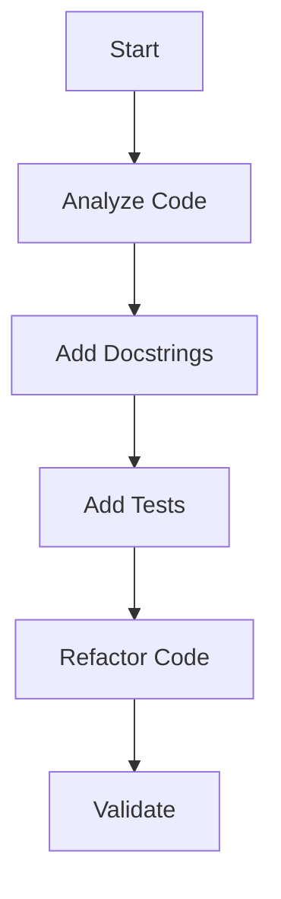

# Refactoring Plan for src/config.py and src/llm.py

## Goal

Improve code coverage and organization for `src/config.py` and `src/llm.py` by applying Kent's principles (TDD, Tidy First).

## Success Criteria

- Code coverage ≥ 80% for both files.
- Well-organized and well-tested code.
- Application of Kent's principles (TDD, Tidy First).

## Risk/Impact Assessment

| Criteria                        | Score |
| ------------------------------- | ----- |
| 3+ modules affected             | +2    |
| Major refactoring               | +2    |
| **Total**                      | **4** |

**Decision**: Master plan (`master_plan.md` + child plans)

## Phases

### Phase 0: Preparation

1. Analyze existing code in `src/config.py` and `src/llm.py`.
2. Identify uncovered lines.
3. Prepare necessary configurations.

### Phase 1: Add Docstrings and Type Annotations

1. Document modules and functions.
2. Add type annotations for robustness.

### Phase 2: Add Tests

1. Write tests to cover uncovered lines.
2. Resolve timeout issues with `pytest`.

### Phase 3: Refactor Code

1. Apply Kent's principles (TDD, Tidy First).
2. Improve code organization.

## Tasks

### Phase 0

- [ ] Analyze `src/config.py` and `src/llm.py`.
- [ ] Identify uncovered lines.

### Phase 1

- [ ] Add docstrings for modules and functions.
- [ ] Add type annotations for functions and variables.

### Phase 2

- [ ] Write tests to cover uncovered lines.
- [ ] Resolve timeout issues with `pytest`.

### Phase 3

- [ ] Apply Kent's principles (TDD, Tidy First).
- [ ] Improve code organization.

## Confidence Assessment

- **Confidence**: 9/10
- **Reasons for high confidence**:
  - Clear and structured plan.
  - Independent phases for better compatibility.
- **Reasons for low confidence**:
  - Timeout issues with `pytest` to resolve.

## Next Steps

1. Create the plan file.
2. Wait for user validation before proceeding with implementation.

## User Journey

## Validation

Please review the plan and provide feedback before proceeding with implementation.