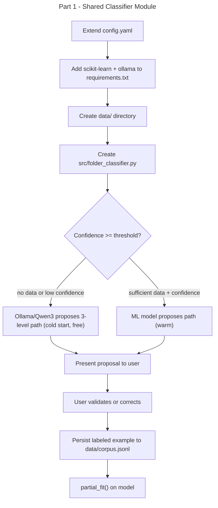

# Instruction: Email Classifier — Part 1: Setup + Shared ML Module

## Feature

- **Summary**: Add scikit-learn and ollama dependencies, extend config, create shared `src/folder_classifier.py` module handling free local-LLM cold start (Ollama/Qwen3), incremental BernoulliNB model, corpus persistence, and user interaction prompt
- **Stack**: `Python 3.x`, `scikit-learn` (includes joblib), `ollama`, `anthropic`, `PyYAML`
- **Branch name**: `feat/email-classifier/part-1-setup`
- **Parent Plan**: `./2026_04_17-email-classifier-master.md`
- **Sequence**: `1 of 4`
- Confidence: 9/10
- Time to implement: 1 session

## Existing files

- @config/config.yaml
- @src/llm.py
- @src/parser.py
- @requirements.txt

### New files to create

- `src/folder_classifier.py`
- `data/.gitkeep`

## User Journey

## Implementation phases

### Phase 0 — Dependencies & Configuration

> Get all config and deps ready before any code

1. Add `scikit-learn` and `ollama` to `requirements.txt` (joblib is bundled with scikit-learn)
2. Extend `config/config.yaml` with:
   - `classify.input_dirs`: list of IMAP account directories to scan (1 level deep: imap_folder/*.md)
   - `classify.exclude_dirs`: list of IMAP folder names to skip (e.g. trash, attachments, sent)
   - `classify.output_dir`: destination tree root (absolute path)
   - `classify.confidence_threshold`: float (e.g. 0.75)
   - `classify.min_samples_before_ml`: int (e.g. 20)
   - `classify.data_dir`: path to data/ directory (resolved relative to project root)
   - `classify.cold_start_model`: Ollama model name (e.g. `qwen3:8b`)
3. Create `data/` directory with `.gitkeep`
4. **Prerequisite**: Ollama must be installed and running locally (`ollama pull qwen3:8b`)

### Phase 1 — src/folder_classifier.py

> Single module shared by classify.py and summarize.py

1. `propose_path(email: dict, config: dict) -> str` — returns a `/`-separated 3-level path
   - If corpus size < `min_samples_before_ml`: call LLM
   - Else: predict with ML model; if confidence < threshold, fall back to LLM
2. `record_decision(email: dict, path: str, config: dict) -> None`
   - Appends labeled example to `data/corpus.jsonl`
   - Registers path in `data/known_classes.json` (set of all paths seen so far)
   - Calls `partial_fit(X=[features], y=[path], classes=all_known_classes)` — passes full class registry on every call to handle dynamic new folders
   - Saves updated model to pickle
3. `rebuild_model_from_corpus(data_dir: Path) -> None` — retrains model from scratch from `corpus.jsonl`; recovery if pickle is corrupted or deleted
4. `_extract_features(email: dict) -> str` — concatenates subject + sender + email_type for TF-IDF
5. `_load_model(data_dir: Path)` / `_save_model(model, data_dir: Path)` — scikit-learn joblib pickle
6. `_llm_propose_path(email: dict, config: dict) -> str` — calls Ollama locally (`ollama.chat`) with configured model (e.g. `qwen3:8b`); prompt asks for a 3-level folder path given subject/sender/date; **free, no API key required**; graceful fallback to rule-based heuristic if Ollama not running
7. `_ml_propose_path(email: dict, model, vectorizer) -> tuple[str, float]` — returns path + confidence score
   - **Risk**: flat path label ("A/B/C") requires more data to generalize than hierarchical (3 separate models); acceptable for MVP, noted for future improvement

### Phase 2 — Interactive prompt helper

> Reusable CLI interaction (used by classify.py and summarize.py)

1. `prompt_user(email: dict, proposed_path: str) -> str` — displays email info + proposal, reads user input
   - Empty input = accept proposal
   - Non-empty input = use as corrected path
   - Validates 3-level format (warn but don't block)

## Validation flow

1. Install dependencies: `pip install scikit-learn`
2. Check `config.yaml` parses correctly with new keys
3. Call `propose_path()` with a sample email dict — should return Ollama path (cold, Ollama running) or rule-based fallback (Ollama not running)
4. Call `record_decision()` — verify `data/corpus.jsonl` and `data/known_classes.json` created and appended
5. After 20+ records with varied paths, call `propose_path()` — should return ML prediction
6. Add a new unseen path via `record_decision()` — verify `known_classes.json` updated and no crash
7. Delete `data/classify_model.pkl`, call `rebuild_model_from_corpus()` — verify model recreated correctly
8. Verify `data/classify_model.pkl` and `data/classify_vectorizer.pkl` created
