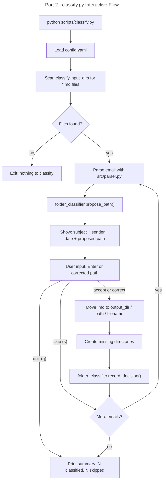

# Instruction: Email Classifier — Part 2: scripts/classify.py

## Feature

- **Summary**: New standalone script that scans configured IMAP directories, classifies each .md email interactively into a 3-level user-defined folder tree, moves files, and feeds the shared incremental model
- **Stack**: `Python 3.x`, `src/folder_classifier.py`, `src/parser.py`, `src/archiver.py`, `PyYAML`
- **Branch name**: `feat/email-classifier/part-2-classify`
- **Parent Plan**: `./2026_04_17-email-classifier-master.md`
- **Sequence**: `2 of 4`
- Confidence: 9/10
- Time to implement: 0.5 session

## Existing files

- @src/parser.py
- @src/archiver.py
- @src/folder_classifier.py
- @config/config.yaml

### New files to create

- `scripts/classify.py`

## User Journey

## Implementation phases

### Phase 1 — scripts/classify.py

> Minimal script, delegates to shared modules

1. `argparse` setup: `--config` (default: config/config.yaml), `--account` (filter by account name, optional)
2. Load config, resolve `classify.input_dirs`, `classify.output_dir`, `classify.exclude_dirs`
3. Collect all `*.md` files: for each input_dir (= one IMAP account), scan 1 level deep (`imap_folder/*.md`), skip dirs listed in `exclude_dirs` (e.g. trash, attachments, sent)
4. For each file:
   - Parse with `src/parser.py`
   - Call `folder_classifier.propose_path(email, config)`
   - Call `folder_classifier.prompt_user(email, proposed_path)` → get final path or skip/quit signal
   - On accept/correct: resolve destination as `output_dir / level1 / level2 / level3 / filename`; if file exists at destination, append counter suffix (`-1`, `-2`, ...) to avoid silent overwrite
   - Create missing dirs, move file
   - Call `folder_classifier.record_decision(email, final_path, config)`
5. Print summary at end

### Phase 2 — Skip/Quit controls

1. User types `s` or `skip` → skip this email (leave in place), no corpus entry
2. User types `q` or `quit` → stop processing, print summary so far
3. Document these controls in the prompt display

## Validation flow

1. Run `python scripts/classify.py --config config/config.yaml`
2. Verify emails are listed one by one with proposal
3. Accept one → verify file moved to correct path in output_dir
4. Correct one → verify file moved to corrected path
5. Skip one → verify file stays in original location
6. Quit → verify summary printed, previously classified files remain moved
7. Check `data/corpus.jsonl` has entries for accepted/corrected emails only
