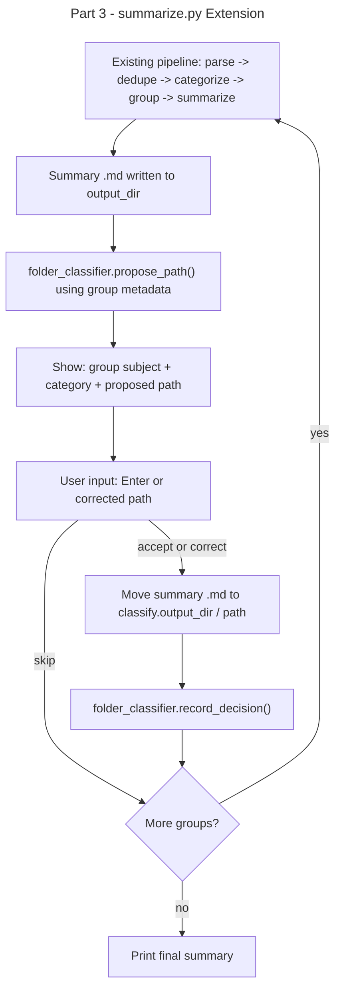

# Instruction: Email Classifier — Part 3: Extend scripts/summarize.py

## Feature

- **Summary**: After each summary file is generated by summarize.py, interactively propose a destination folder in the shared tree, move the summary file there, and feed the shared corpus
- **Stack**: `Python 3.x`, `src/folder_classifier.py`, `PyYAML`
- **Branch name**: `feat/email-classifier/part-3-summarize`
- **Parent Plan**: `./2026_04_17-email-classifier-master.md`
- **Sequence**: `3 of 4`
- Confidence: 9/10
- Time to implement: 0.5 session

## Existing files

- @scripts/summarize.py
- @src/folder_classifier.py
- @config/config.yaml

## User Journey

## Implementation phases

### Phase 1 — Extend summarize.py

> Minimal addition inside the existing group processing loop

1. After `output_path.write_text(result, ...)` succeeds (line ~180), add classification step:
   - Build a minimal email-like dict from group metadata: subject (first email), sender (first email), email_type (category)
   - Call `folder_classifier.propose_path(meta, config)` → proposed path
   - Call `folder_classifier.prompt_user(meta, proposed_path)` → final path or skip
   - On accept/correct: resolve destination as `classify_output_dir / path / output_path.name`; if file exists, append counter suffix to avoid silent overwrite; move file; create missing dirs
   - **Do not write to `notes_dir` then move** — write summary directly to `output_path` in `notes_dir` as staging, then move to classified path immediately (atomic: write → classify → move in same loop iteration). If classification skipped, file stays in `notes_dir` as fallback.
   - Call `folder_classifier.record_decision(meta, final_path, config)`
2. Add `classify.output_dir` check: if not configured, skip classification step silently (backward compatible)
3. Import `folder_classifier` at top of file

### Phase 2 — Backward compatibility

1. If `classify` section absent from config → summarize.py behaves exactly as before (no interactive prompt, no file move)
2. Add `--no-classify` flag to skip classification step even when config present

## Validation flow

1. Run `python scripts/summarize.py` with classify config present
2. Verify summary files are written to output_dir first (existing behavior)
3. Verify classification prompt appears after each summary generation
4. Accept one → verify summary file moved to classify.output_dir / path
5. Skip one → verify summary file stays in output_dir
6. Run with `--no-classify` → verify no prompt appears, behavior unchanged
7. Run without classify config → verify no prompt appears
8. Check corpus.jsonl has entries for accepted/corrected summaries
