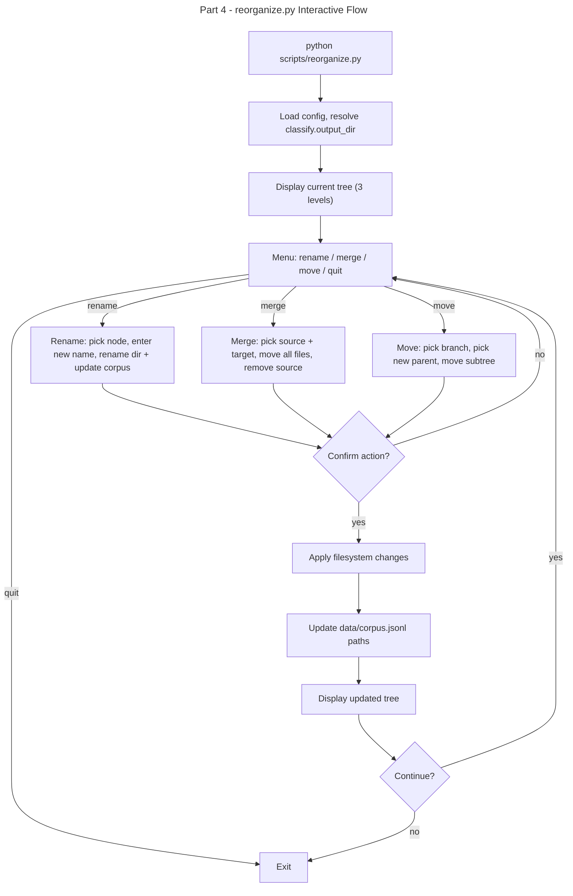

# Instruction: Email Classifier — Part 4: scripts/reorganize.py

## Feature

- **Summary**: Standalone interactive script to restructure the destination folder tree — rename, merge, or move branches — updating all file paths accordingly
- **Stack**: `Python 3.x`, `PyYAML`
- **Branch name**: `feat/email-classifier/part-4-reorganize`
- **Parent Plan**: `./2026_04_17-email-classifier-master.md`
- **Sequence**: `4 of 4`
- Confidence: 8/10
- Time to implement: 0.5 session

## Existing files

- @config/config.yaml

### New files to create

- `scripts/reorganize.py`

## User Journey

## Implementation phases

### Phase 1 — Tree display

> Read and display the existing folder tree

1. Walk `classify.output_dir` up to 3 levels deep
2. Display as indented tree in CLI
3. Number each node for easy selection

### Phase 2 — Operations

> Three atomic operations, each with confirm step

1. **Rename**: select node by number → enter new name → confirm → `os.rename()` on dir
2. **Merge**: select source node + target node (same level) → confirm → `shutil.move()` all files from source to target → `os.rmdir()` source
3. **Move**: select a subtree node → select new parent → confirm → `shutil.move()` subtree

### Phase 3 — Corpus update

> After any filesystem change, update stored paths in corpus

1. Load `data/corpus.jsonl`
2. For each entry: if `label` matches old path prefix → replace with new path
3. Rewrite `corpus.jsonl`
4. Print count of updated corpus entries

## Validation flow

1. Run `python scripts/reorganize.py`
2. Verify tree displays correctly
3. Rename a leaf node → verify directory renamed on disk, corpus entries updated
4. Merge two sibling nodes → verify files moved, source dir removed, corpus updated
5. Move a subtree → verify all files under subtree moved to new parent
6. Quit → verify already-confirmed operations are persisted, only the current (unconfirmed) session ends
