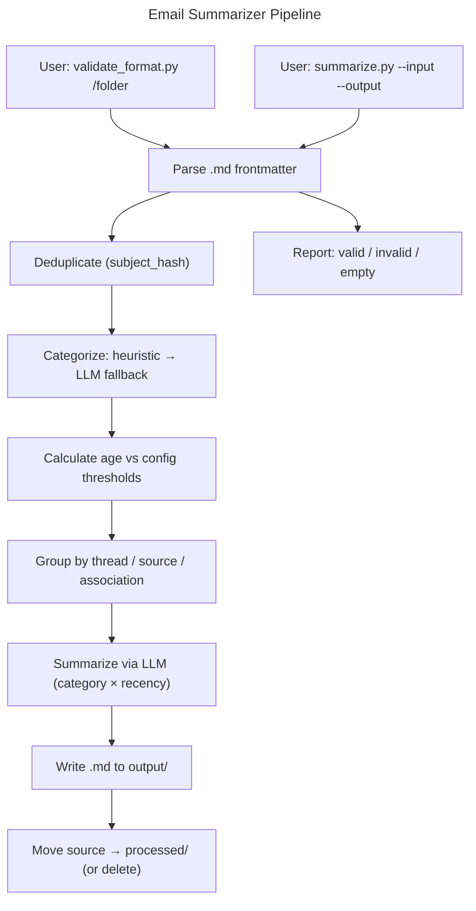

# Instruction: Email Summarization CLI

## Feature

- **Summary**: Python CLI tool to validate, categorize by type and recency, deduplicate, group, and summarize email `.md` files (from email2markdown) into structured actionable documents. Sources archived to `processed/` after treatment.
- **Stack**: `Python 3.11+, argparse, PyYAML, python-frontmatter, anthropic`
- **Branch name**: `feat/email-summarizer`
- **Parent Plan**: `none`
- **Sequence**: `standalone`
- Confidence: 8/10
- Time to implement: 3-4 days

## Existing files

- `aidd_docs/tasks/user-stories.md`
- `README.md`

### New files to create

- `requirements.txt`
- `config/config.yaml.example`
- `scripts/validate_format.py`
- `scripts/summarize.py`
- `src/__init__.py`
- `src/parser.py`
- `src/categorizer.py`
- `src/age.py`
- `src/deduplicator.py`
- `src/grouper.py`
- `src/llm.py`
- `src/summarizers/__init__.py`
- `src/summarizers/travail.py`
- `src/summarizers/notification.py`
- `src/summarizers/newsletter.py`
- `src/summarizers/associatif.py`
- `src/archiver.py`

## User Journey

## Implementation phases

### Phase 0 — Setup

> Project structure and configuration ready before any code

1. Create `requirements.txt`: `python-frontmatter`, `PyYAML`, `anthropic`
2. Create `config/config.yaml.example`:
   - `llm.api_key`, `llm.model`
   - `thresholds.travail_days` (default: 30)
   - `thresholds.notification_days` (default: 7)
   - `thresholds.newsletter_days` (default: 14)
3. Create `src/__init__.py`, `src/summarizers/__init__.py`

### Phase 1 — Validation (US-01)

> `validate_format.py` operational end-to-end

1. `src/parser.py`: parse `.md` frontmatter, return typed dict (`from`, `to`, `date`, `subject`, `subject_hash`, `email_type`)
2. `scripts/validate_format.py`: accepts folder path argument
   - Uses `src/parser.py` to parse each `.md`
   - Reports: valid count, invalid files + reason, empty folder warning

### Phase 2 — Categorization + Grouping

> Each email has a category, an age, and belongs to a group

1. `src/age.py`: compute age in days from `date` frontmatter field
2. `src/categorizer.py`:
   - Primary signal: `email_type` frontmatter field (`mailing_list` → newsletter/associatif, `direct` → travail/notification, `group` → travail)
   - Secondary: sender domain patterns, subject keywords
   - Returns: `travail | notification | newsletter | associatif`
   - LLM fallback (via `src/llm.py`) when primary signal is absent or ambiguous
3. `src/deduplicator.py`: detect exact duplicates by `subject_hash` + same sender, keep one representative
4. `src/grouper.py`:
   - Travail: group by normalized subject (strip `Re:`, `Fwd:`, lowercase, trim) — NOT subject_hash
   - Notification: group by sender + event type
   - Newsletter: group by sender
   - Associatif: group by sender (one page per association)

### Phase 3 — Summarization (US-02)

> LLM generates the right summary for each category × recency combination

1. `src/llm.py`: Anthropic API wrapper (load key from config, single `complete()` method)
2. `src/summarizers/travail.py`:
   - Recent: full fiche (chronology, status, pending actions)
   - Old: condensed (final status + date)
3. `src/summarizers/notification.py`:
   - Recent: fiche with action + links
   - Old: single line action + date (deduplicated)
4. `src/summarizers/newsletter.py`:
   - Recent: bullet points of notable items (+ view-online link if present)
   - Old + view-online link: link only
   - Old + no link: return `None` (no file generated)
5. `src/summarizers/associatif.py`:
   - Always: single aggregated page per association, chronological, with links preserved
6. Output filename: slugified `subject` from frontmatter + `.md`; for aggregated outputs (newsletter, associatif) where no single subject exists, LLM generates the slug

### Phase 4 — CLI + Archiving (US-02, US-03)

> End-to-end pipeline callable from terminal

1. `src/archiver.py`:
   - On success: move source file to `processed/` (create if missing)
   - On error: leave source in place, log error
   - With `--delete`: delete source instead of moving
2. `scripts/summarize.py`:
   - `argparse`: `--input` (required), `--output` (required), `--delete` (flag), `--config` (optional, default `config/config.yaml`)
   - Main pipeline: load config → parse → deduplicate → categorize → age → group → summarize → write output → archive
   - `processed/` created as sibling of `--input` dir by default
   - Create `--output` and `processed/` dirs if missing
   - Continue on error: process all files, report failures at end with non-zero exit code

## Validation flow

1. Run `python scripts/validate_format.py C:/Users/fxgui/Documents/Emails/to-summarize/`
   - Expect: valid count report, no crash
2. Run `python scripts/summarize.py --input C:/Users/fxgui/Documents/Emails/to-summarize/ --output ./summarized/`
   - Expect: 4 output files matching the 4 validated formats
   - Expect: sources moved to `processed/`
3. Verify `email_2025-09-03_DE_SuppressionA` thread → condensed travail summary (7 months old)
4. Verify Firebase x3 → single notification line, deduplicated
5. Verify Kickstarter Jan-Mar → no file (old, no view-online link)
6. Verify L'Affaire du Siècle x4 → single aggregated associatif page with Apr 16 replay link
7. Run with `--delete` → confirm `processed/` not used, sources deleted

## Confidence assessment

- ✅ Requirements fully validated on real emails
- ✅ Output formats confirmed by user on 4 real cases
- ✅ Stack is standard Python, no exotic dependencies
- ✅ Pipeline is linear, phases are independent
- ❌ LLM prompt quality unknown until tested (summary accuracy)
- ❌ Heuristic categorization accuracy untested (LLM fallback coverage unknown)
- ❌ Fine-tuned models deferred to v2 (using prompt-based LLM for v1)
